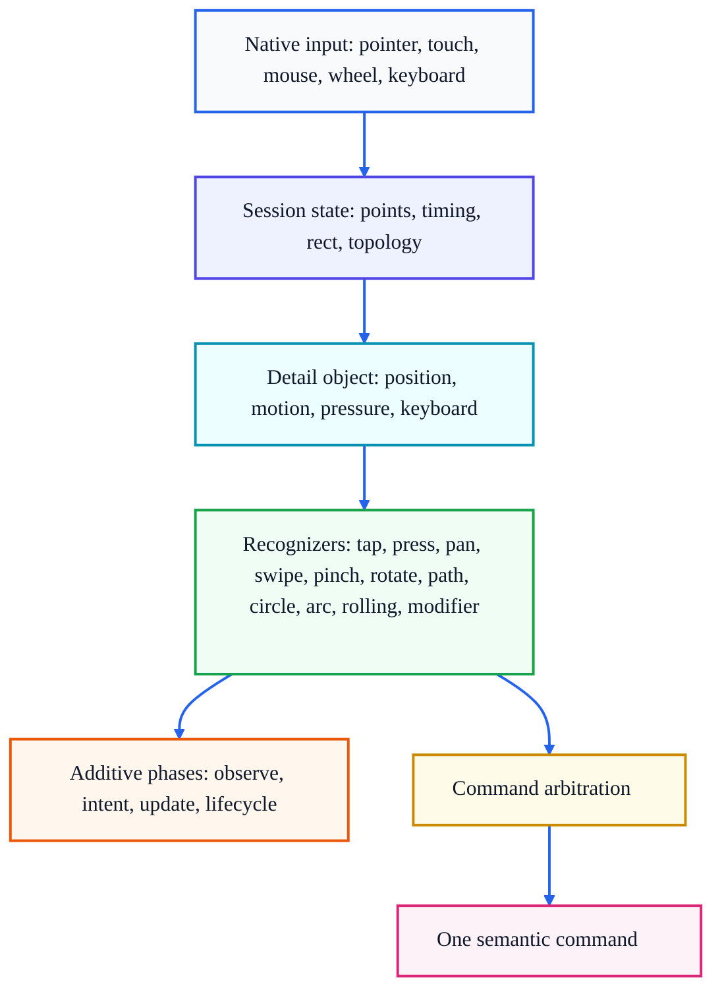
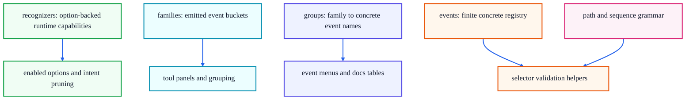

# Architecture

This file is for maintainers who need to change HandTrick internals. Read the README first if you only need the public API. Read CONTRIBUTING for workflow, tests, and release checks.

HandTrick is built as a sectioned runtime. Source files in `src/` are concatenated by `scripts/build.js` into browser global/CommonJS, readable ESM, minified global, and minified ESM outputs.

## Runtime Shape

The runtime has one job: normalize browser input into a stable semantic detail object, then dispatch additive observations and one command winner.



The important invariant is that app code receives public detail snapshots; recognizers and dispatch must not leak mutable private session state.

## Source Order

Section order is part of the implementation because files are concatenated, not imported.

| Section | Role |
| --- | --- |
| `core/00-foundation.js` | Constants, default keyboard roles, event registry helpers. |
| `core/01-events.js` | Public event groups and recognizer registries. |
| `core/02-defaults.js` | Default options, recognizer thresholds, ownership flags. |
| `core/03-aliases.js` | Motion candidate recognizer groups. |
| `core/04-math.js` | Direction, axis, geometry, numeric helpers. |
| `core/05-selectors.js` | Selector parser, specificity, sequence/path detection. |
| `core/06-state.js` | Option resolution, merge behavior, state helpers. |
| `core/07-keyboard.js` | Keyboard combo normalization and role matching. |
| `core/08-matching.js` | Path tokenization, path matching, sequence matching primitives. |
| `core/09-regions.js` | Region, grid, edge, and zone helpers. |
| `core/10-presets.js` | Named preset construction. |
| `class/00-setup.js` | Constructor and static defaults/create/preset helpers. |
| `class/01-listeners.js` | Native listener binding, public listener API, dispatch helpers. |
| `class/02-state.js` | Enable/disable/destroy/reset, option updates, state snapshots. |
| `class/03-dom.js` | DOM style suppression, selection guard, tap guard. |
| `class/04-input.js` | Pointer/touch/mouse session input. |
| `class/05-wheel-points.js` | Wheel normalization and point export. |
| `class/06-intent.js` | Intent cache, pruning, recognizer activation. |
| `class/07-modifier.js` | Pointer and keyboard modifier gestures. |
| `class/08-pan-path.js` | Pan and held-path recognizers. |
| `class/09-transforms.js` | Pinch and rotate recognizers. |
| `class/10-rolling.js` | Rolling tap recognizer. |
| `class/11-detail.js` | Detail object and position payload assembly. |
| `core/11-static.js` | Static API attached after class exists. |

Adding a file means updating `scripts/build.js`. Reordering files can change runtime behavior even without direct code changes.

## Project Structure

| Path | Purpose | Change when |
| --- | --- | --- |
| `src/` | Sectioned runtime source. | Runtime behavior, public selectors, options, payloads. |
| `handtrick.js` | Generated global/CommonJS runtime. | Generated by `npm run build`; inspect wrapper behavior only. |
| `handtrick.mjs` | Generated readable ESM runtime. | Generated by `npm run build`; inspect export shape only. |
| `handtrick.min.js` | Minified browser/global distributable. | Generated by `npm run build`. |
| `handtrick.min.mjs` | Minified direct ESM distributable. | Generated by `npm run build`. |
| `scripts/build.js` | Node build helper. | Source order, UMD wrapper, module output, build workflow. |
| `index.d.ts` | Public declarations. | Public API, events, criteria, payload, option shape. |
| `README.md` | Consumer guide. | Public behavior or learning path changes. |
| `CONTRIBUTING.md` | Contributor workflow. | Workflow, verification, release, docs standard changes. |
| `ARCHITECTURE.md` | Runtime internals. | Architecture or implementation model changes. |
| `examples/` | Browser examples in learning order. | Public feature examples or UX demos change. |
| `inspector/` | Manual inspection workbench. | Debugging or event visualization changes. |
| `test/` | Node test suite with DOM-like helpers. | Every behavior change. |
| `package.json` | Package metadata, scripts, published files. | Entry points, scripts, files, version metadata. |

## Option Resolution

Constructor input accepts:

- `(target, options)`
- `(target, 'preset')`
- `({ target, ...options })`
- preset arrays such as `['media', { rotate: { enabled: true } }]`
- preset functions that return options

Initial resolution merges in this order:

1. Defaults.
2. Collected presets, left to right.
3. Explicit options.
4. Normalization, currently including `path.consume`.

`setOptions` resolves a partial option input, merges it onto current options, updates explicit enabled/disabled recognizer toggles, and rebinds native listeners where needed.

## Input And Session State

Input mode is resolved from `options.input`:

| Mode | Native routes |
| --- | --- |
| `pointer` | Pointer events only. |
| `touch` | Touch events only. |
| `mouse` | Mouse events only. |
| `hybrid` | Touch and mouse. |
| `auto` | Pointer events when available, else hybrid. |

`windowEvents` controls whether move/up/cancel listeners bind to the window/document root or only to the target. Full-surface tools usually want the default `true`; isolated test helpers often set it `false`.

Session state tracks active points, max topology, start time, phase start, tap memory, gesture sequence memory, keyboard state, ownership, and cached rect. Rect mode matters:

| Rect mode | Behavior |
| --- | --- |
| `session` | Cache target rect for the current session. |
| `live` | Re-read rect when detail is built. |
| `static` | Cache until `refreshRect()`. |

## Detail Assembly

Every semantic event gets a cloned detail object. The builder combines:

- current, previous, and start center snapshots
- pointer snapshots
- target rect and position buckets
- movement, velocity, distance, angle, pressure
- keyboard and keyboard-substitute state
- motion shape and confidence scores
- topology, ownership, intent, consumed/claimed flags
- gesture-specific fields such as `tapSequence`, `gestureSequence`, `pathSegments`, `rolling`, `modifier`

Invariants:

- `instance` is non-enumerable.
- Positions are snapshots.
- Criteria match public detail fields.
- Gesture-specific fields are additive.

## Listener Registration

Registration path:

1. Normalize selector text.
2. Parse sequence selector when `>` is a released sequence pattern.
3. Parse event selector otherwise.
4. Store listener record with type, criteria, phase, parsed selector, sequence info, and order.
5. Activate recognizer family from selector.
6. Invalidate intent cache.

Default phase is `command` for final semantic release/path commands and `observe` for wildcard, lifecycle, progress, start/end, pressure, wheel, and `swipe:intent`.

Supported phases:

| Phase | Behavior |
| --- | --- |
| `command` | Exclusive app action arbitration. |
| `observe` | Additive diagnostics/live UI. |
| `intent` | Additive pre-command intent phase. |
| `update` | Additive update phase. |

## Selector Grammar

Canonical selector shape is:

```txt
family[:mode][:count][:direction][:state]
```

Examples:

| Raw | Canonical | Meaning |
| --- | --- | --- |
| `Swipe:Right` | `swipe:right` | Directional swipe command. |
| `tap:2x>swipe:left` | `tap:2x>swipe:left` | Released sequence. |
| `right>down>left>up` | `right>down>left>up` | Bare path command. |
| `rotate:mod:cw` | `rotate:mod:cw` | Clockwise rotate while modifier keys are active. |
| `path:right>down` | opaque | Prefixed path syntax is invalid by design. |

Selector parser strictness is intentional. Unknown or invalid selectors remain opaque and must not activate recognizers by accident.

Direction and count aliases such as `tap:2x` belong in the selector. Finger count and swipe speed belong in criteria. Use `hand.command('swipe:left', { fingers: 2, speed: 'flick' }, fn)`.

## Intent And Activation

Recognizer activation comes from explicit `intent.events` and registered listeners.

Practical rules:

- Prefer `intent.events: null` unless an explicit whitelist is required before listeners exist.
- If explicit `intent.events` is used, keep it in sync with commands.
- `observe()` is additive for dispatch, but it still activates the recognizer family.
- Criteria such as `region`, `grid`, `startGrid`, `fingers`, and `path` filter handlers after recognition. They do not prevent recognizer work or consumption unless the recognizer has its own option gate.
- `ignore` and separate targets are the reliable ways to keep a native area outside a gesture instance.

Fast path pruning may skip unneeded families when listener-derived or explicit intent leaves a small candidate set. Do not fix false positives by broad suppression until stronger recognizer proof or delayed fallback has been considered.

## Registry Map

The public registries overlap by design. Pick the smallest registry that answers the question.



Use `recognizers` for option-backed blocks such as `path`, `pressure`, or `wheel`. Use `families` when an emitted bucket exists but no direct option block does, such as `circle` or `arc`. Use `groups` for concrete menus. Use `events` for finite registered event names only; path strings, sequences, and counted circles are parsed grammar, not complete registry entries.

## Recognizers

| Recognizer | Primary proof | Important negative guard |
| --- | --- | --- |
| Tap | Short duration and low travel. | Movement beyond `tap.maxMove` rejects tap. |
| Press | Timer survives without movement beyond `press.move`. | Cancels on movement or competing consumed gesture. |
| Pan | Translation confidence and optional axis gate. | Does not start after pinch/rotate begins. |
| Swipe | Release distance/velocity and direction. | Release guard prevents one-finger leftovers after multi-touch. |
| Pinch | Distance/scale change dominates translation. | Parallel two-finger movement should stay pan-like. |
| Rotate | Angular proof and moved-finger proof. | Parallel swipe-like motion should not rotate. |
| Path | Cardinal segments, turn angle, pause limits. | Straight jitter and wrong turns should not build commands. |
| Circle | Four path segments that form a complete cardinal cycle. | Wrong order, repeated direction, or incomplete cycle stays a normal path. |
| Arc | Three path segments starting toward a cardinal direction. | Wrong middle axis or missing opposite return stays a normal path. |
| Rolling | Staggered overlapping contact wave. | Simultaneous multi-finger taps remain taps. |
| Modifier | Anchor plus action pointer or exact keyboard combo. | Anchor movement/time limits prevent accidental modifier sessions. |
| Pressure | Aggregate pressure delta over threshold. | Observe-only stream; it does not become an exclusive command family. |
| Wheel | Normalized wheel delta. | `ignore` and `wheel.enabled` can stop processing. |

When two recognizers plausibly claim the same motion, the preferred fix is usually stronger proof or delayed fallback, not broad suppression.

## Ownership

`session.claimed` and `session.consumed` are different systems:

| Mechanism | Purpose | Effect |
| --- | --- | --- |
| Claim | Native event ownership. | May call `preventDefault()` / `stopPropagation()` once confidence crosses `claim.threshold`. |
| Consumed | Semantic gesture ownership. | Blocks release fallback such as tap, rolling tap, and swipe unless a recognizer explicitly allows fallback. |

Most continuous commands consume once they commit. Pan, pinch, rotate, modifier pan, rolling, and press use consumption to prevent a later release gesture from firing on the same session. Swipe consumes when it emits. Path is special because `path.consume` can be `auto`, `eager`, or `never`.

Path/swipe rule learned from the player regression:

- Listener-derived intent means any path listener can activate path.
- Criteria are command filters, not recognizer start gates.
- `path.consume: 'eager'` consumes on the first path segment; a straight one-finger swipe can be that segment.
- Default `path.consume: 'auto'` does not consume a single straight segment, but consumes after a turn or command-phase path winner.
- `path.consume: 'never'` allows path and release gesture coexistence, including possible command plus final swipe double-fire.
- Only string consume modes are supported. Invalid values, including booleans and `null`, fall back to `auto`.

When changing ownership, test both sides of the conflict. A fix that makes one gesture fire must also prove the intended competing gesture does or does not fire.

## Resolvers

### Tap Chain

Tap memory stores nearby taps inside `tap.interval` and `tap.distance`. `tap:2x` and `tap:3x` are counts inside that chain, not unrelated taps. `tap:sequence` is additive history; command tap aliases still arbitrate.

### Path Resolver

Path resolver keeps suffix matches pending while a longer registered path can still continue. When no longer match can win, it emits the longest exclusive winner and records resolved lengths so shorter suffixes do not fire later in the same path session.

This applies to bare path commands and path criteria.

Circle is resolved through the path resolver. A four-segment suffix matching `right>down>left>up` from any start emits `circle:cw`; the reverse cycle emits `circle:ccw`. Top-level circle items stay pending until path release or pause so overlapping live suffixes do not emit extra commands. Single-count circle selectors emit once per non-overlapping complete loop in the final path. Counted selectors such as `circle:2x:cw` win over their overlapping one-count circle items when registered. Finger count belongs in criteria, such as `hand.on('circle:cw', { fingers: 2 }, fn)`. Explicit `1x` canonicalizes away, so `circle:1x:cw` becomes `circle:cw`. The path parser treats circle as an atom, so the same count/direction adjusters work inside longer patterns such as `up>circle:2x:cw` and path criteria. A longer path pattern made only of directions may coexist with circle commands that would previously have fired live, but a longer pattern that contains its own circle atom owns that atom. `path.maxCircleCount` bounds retained path length for accidental huge count selectors and repeated one-count circle loops.

Arc is also resolved through the path resolver. A three-segment suffix starting in one cardinal direction, turning perpendicular, and returning through the opposite direction emits `arc:{startDirection}`. `up>right>down` and `up>left>down` both emit `arc:up`.

### Sequence Resolver

Sequence resolver appends committed released gestures to `gestureSequence`, scans sequence listeners, and queues direct emits while a longer registered sequence can still win. Exact matches prefer longest and most specific patterns. When a sequence command wins, pending direct emits for that chain are cleared.

Aggregate tap aliases expand before matching:

- `tap:2x>swipe` equals `tap>tap>swipe`.
- `tap:3x>swipe` equals `tap>tap>tap>swipe`.

## Modifier And Keyboard Roles

Keyboard combos are normalized exact matches. Roles split into:

- `modifier`: labels modifier gestures such as `tap:mod` and `pan:mod`.
- `twoFingers`, `threeFingers`, `fourFingers`: substitute effective finger count.
- `rollingTap`: turns directional Meta-click chains into keyboard rolling.

Keyboard substitution changes `fingers` and `maxFingers`; physical pointer count stays in `actualFingers`. Criteria can route with `fingerSource`, `keyboardRole`, `modifierName`, `modifierSource`, `modifierKeys`, `combo`, `keys`, or `key`.

Pointer modifier sessions use anchor and action pointers. Keyboard modifier sessions use key state plus the action pointer. Both build `modifier` metadata and action deltas for command handlers.

Swipe, pinch, and rotate modifier forms are separate command types. Modified payloads still set `modified: true`, but `swipe:mod:right` competes as a more specific command than `swipe:right`.

## Criteria Matching

Criteria values normalize before comparison. Position criteria check current, start, tap-start, sequence-start, modifier, grid, edge, area, region, and path values. Gesture criteria check direction, axis, fingers, source, keyboard role, pointer type, tap count, sequence steps, and modifier metadata. Unknown criteria keys fail closed so typoed handlers do not broaden.

Criteria matching must stay side-effect free. A handler either becomes eligible or is skipped; criteria must not mutate session state.

## DOM Suppression

DOM suppression has three layers:

- Target styles such as `touch-action`, `user-select`, and WebKit callout guards.
- Capture-time tap guard for rapid native tap/loupe suppression.
- Claim-time native event calls after confidence threshold.

`ignore` runs before recognizers. Ignored input emits `input:ignored` and should leave active gesture state clean.

Use DOM suppression tests for any change touching selection guard, tap guard, style restoration, destroy cleanup, or native preventDefault behavior.

## Build Outputs

Build output expectations:

| Output | Requirement |
| --- | --- |
| `handtrick.js` | CommonJS `module.exports` and browser global `HandTrick` remain available. |
| `handtrick.mjs` | Direct default and named ESM exports remain available. |
| `handtrick.min.js` | Minified global/CommonJS behavior matches readable global. |
| `handtrick.min.mjs` | Minified ESM behavior matches readable ESM. |
| `index.d.ts` | Public API matches runtime names and payload fields. |

Before publishing or handing off a broad runtime change, verify source, generated entries, readable tests, minified tests, and package dry run as described in CONTRIBUTING.
